# 🏋️ Sistema de Gerenciamento de Academia

Projeto desenvolvido para a disciplina de Programação Orientada a Objetos (POO) do **IFRN**. O sistema tem como objetivo gerenciar o fluxo de matrículas de alunos e contratação de instrutores, além de fornecer relatórios administrativos e financeiros.

---

## 📋 Sobre o Projeto

Este sistema é uma aplicação Java baseada em console que utiliza conceitos avançados de Orientação a Objetos e uma **Arquitetura em Camadas (Layered Architecture)** para garantir organização, escalabilidade e facilidade de manutenção.

O foco principal foi a implementação de regras de negócio robustas, validação de dados rigorosa e segurança na exibição de informações sensíveis através de DTOs.

---

## ⚙️ Funcionalidades (Requisitos Funcionais)

O sistema atende aos seguintes requisitos:

### 1. Gestão de Contratos (CRUD)
* **Cadastro:** Permite registrar novos **Alunos** (com planos e frequência) e **Instrutores** (com especialidade e carga horária).
* **Consulta:** Listagem detalhada e resumida de todos os vínculos ativos e inativos.
* **Edição:** Atualização de dados cadastrais (telefone, nome) e contratuais (plano, salário, carga horária).
* **Encerramento:** Permite cancelar matrículas ou demitir instrutores, mantendo o histórico (Log de cancelamento).
* **Exclusão:** Remoção definitiva de registros (apenas para correções administrativas).

### 2. Domínio Específico
* Gerenciamento de **Modalidades de Treino** (Musculação, CrossFit, etc.).
* Gerenciamento de **Planos** (Basic, Elite, Premium) com valores diferenciados.
* Cálculo automático de **Lucro** (Receita de Alunos - Despesa com Instrutores).

### 3. Relatórios
* Relatório de Alunos (Protegido via DTO).
* Relatório de Instrutores (Protegido via DTO).
* Relatório Financeiro (Lucro total e Lucro histórico por ano).

---

## 🛠️ Tecnologias e Conceitos (Requisitos Técnicos)

O projeto demonstra o uso prático dos pilares da POO e recursos modernos do Java:

* **Java 17+**: Uso de `Records`, `Switch Expressions` e `Streams API`.
* **Arquitetura**: Separação clara em `Dominio`, `Repositorio`, `Service` e `View`.
* **Coleções**: Uso intensivo de `HashMap` para busca O(1) (por CPF) e `List`/`Collection` para manipulação de dados.
* **Herança e Polimorfismo**:
    * `Pessoa` (Classe Base Abstrata)
    * `Contrato` (Adiciona regras de vigência) -> estende `Pessoa`
    * `Aluno` e `Instrutor` -> estendem `Contrato`
* **Encapsulamento**: Atributos privados, acesso via Getters/Setters e proteção da lista do Repositório (retornando cópias ou collections não modificáveis).
* **Interfaces**: Aplicação do princípio de Segregação de Interfaces (ISP) nos serviços (`CadastroContratoService`, `ConsultaContratoService`, etc.).
* **Records**: Utilizados para DTOs (`RelatorioAlunoDTO`), garantindo imutabilidade na transferência de dados.
* **Tratamento de Exceções**: Exceções personalizadas (`SexoInvalidoException`, `PlanoTreinoInvalidoException`) e try-catch na camada de visualização.

---

## 📂 Estrutura do Projeto

```text
src/
├── dominio/           # Regras de Negócio e Entidades (Core)
│   ├── enums/         # Constantes (Plano, Sexo, Modalidade)
│   ├── exceptions/    # Exceções Personalizadas
│   └── ...            # Classes Aluno, Instrutor, Pessoa
│
├── repositorio/       # Persistência de Dados
│   └── RepositorioAcademia.java (Banco de dados em memória)
│
├── service/           # Lógica de Aplicação
│   ├── dto/           # Data Transfer Objects (Objetos de Visualização)
│   ├── impl/          # Implementação das Regras de Negócio
│   └── ...            # Interfaces dos Serviços
│
├── view/              # Interface com Usuário
│   ├── util/          # Utilitários de Entrada (Scanner)
│   └── MenuConsole.java
│
└── Main.java          # Ponto de Entrada e Injeção de Dependências
```

## 🚀 Como Executar

Para rodar o projeto localmente, siga os passos abaixo:

### Pré-requisitos
* **Java JDK 17** ou superior instalado (Necessário devido ao uso de `records` e `switch expressions`).
* Uma IDE Java de sua preferência (IntelliJ IDEA, Eclipse, NetBeans ou VS Code).

### Passo a Passo
1. **Clonar ou Baixar:**
   Faça o download do código-fonte ou clone este repositório.
   ```bash
   git clone https://github.com/alibruno/ifrn-poo-gerenciamentoAcademia.git
   ```
2. **Abrir na IDE:**
   Abra a pasta do projeto na sua IDE. Aguarde a indexação e o reconhecimento do JDK.

3. **Executar:**
    * Navegue até a pasta `src`.
    * Localize o arquivo `Main.java`.
    * Clique com o botão direito no arquivo e selecione a opção **"Run 'Main.main()'"** (ou o botão de Play verde da sua IDE).

4. **Interagir:**
   O menu interativo aparecerá no console da IDE. Utilize os números para navegar entre as opções.
   > **Nota:** O sistema inicia com uma carga de dados pré-definida (**Seed Data**) na memória. Isso facilita os testes de relatórios e consultas sem a necessidade de cadastrar dezenas de registros manualmente.

---

## ✅ Validações Implementadas

O sistema conta com uma classe utilitária robusta (`ValidarAtributos.java`) que garante a integridade e consistência dos dados:

* **CPF:** Implementação completa do algoritmo de validação (Módulo 11), verificando os dois dígitos verificadores, tamanho incorreto e rejeitando sequências repetidas (ex: 111.111.111-11).
* **Telefone:** Verifica o formato para números fixos (10 dígitos) e celulares (11 dígitos), validando também os prefixos de DDD.
* **Idade:** Impede o cadastro de idades inverossímeis (menores que 0 ou maiores que 100).
* **Duplicidade:** O sistema impede o cadastro de um novo contrato (Aluno ou Instrutor) caso o CPF já exista na base de dados (Map).
* **Tipagem Forte (Enums):** Campos como *Sexo*, *Plano de Treino*, *Frequência* e *Modalidade* são validados contra listas fechadas (Enums), impedindo a inserção de valores arbitrários.

---

## 📊 Diagrama de Classes

Abaixo está o diagrama UML representando a estrutura das classes, interfaces, records e seus relacionamentos.

```mermaid
classDiagram
    %% --- PACOTE DOMINIO ---
    namespace Dominio {
        class Pessoa {
            <<abstract>>
            -String nome
            -String CPF
            -String telefone
            -int idade
            +getNome() String
            +getCPF() String
            +setTelefone(String)
            +setIdade(int)
        }

        class Contrato {
            <<abstract>>
            -LocalDate dataDeInclusao
            -boolean cancelouMatricula
            -LocalDate dataDeCancelamento
            +isCancelouMatricula() boolean
            +setCancelouMatricula(boolean)
        }

        class Aluno {
            -String matricula
            +getPlano() PlanoTreino
            +getFrequencia() FrequenciaPagamento
            +toString() String
        }

        class Instrutor {
            -String ID
            -int cargaHoraria
            -BigDecimal salario
            +getSalario() BigDecimal
            +getModalidade() ModalidadeTreino
            +toString() String
        }

        class Sexo {
            <<enumeration>>
            MASCULINO
            FEMININO
        }

        class PlanoTreino {
            <<enumeration>>
            BASIC
            ELITE
            PREMIUM
            +getValor() BigDecimal
        }

        class ModalidadeTreino {
            <<enumeration>>
            MUSCULACAO
            CROSSFIT
            DANCA
            FUNCIONAL
            SPINNING
        }
        
        class FrequenciaPagamento {
            <<enumeration>>
            MENSAL
            ANUAL
            SEMESTRAL
        }
    }

    %% RELACIONAMENTOS DOMINIO
    Pessoa <|-- Contrato : Herança
    Contrato <|-- Aluno : Herança
    Contrato <|-- Instrutor : Herança
    Pessoa ..> Sexo : Usa
    Aluno ..> PlanoTreino : Usa
    Aluno ..> FrequenciaPagamento : Usa
    Instrutor ..> ModalidadeTreino : Usa

    %% --- PACOTE REPOSITORIO ---
    namespace Repositorio {
        class RepositorioAcademia {
            -Map~String, Aluno~ alunos
            -Map~String, Instrutor~ instrutores
            +salvarAluno(Aluno)
            +buscarAluno(String) Optional~Aluno~
            +listarAlunos() Collection~Aluno~
            +salvarInstrutor(Instrutor)
            +buscarInstrutor(String) Optional~Instrutor~
            +listarInstrutores() Collection~Instrutor~
            +existePessoa(String) boolean
        }
    }

    %% RELACIONAMENTOS REPOSITORIO
    RepositorioAcademia o-- Aluno : Agregação
    RepositorioAcademia o-- Instrutor : Agregação

    %% --- PACOTE SERVICE ---
    namespace Service {
        class RelatorioAlunoDTO {
            <<record>>
            String nome
            String matricula
            String plano
            String status
            String dataEntrada
        }

        class RelatorioInstrutorDTO {
            <<record>>
            String nome
            String idFuncional
            String modalidade
            int cargaHoraria
            String status
        }
        
        class ValidarAtributos {
            <<utility>>
            +isCPFinvalido(String) boolean
            +isTelefoneInvalido(String) boolean
            +isIdadeInvalida(int) boolean
            +validarSexo(String) Sexo
        }

        %% Interfaces com Métodos
        class CadastroContratoService { 
            <<interface>> 
            +cadastrarAluno(String nome, String cpf...)
            +cadastrarInstrutor(String nome, String cpf...)
        }
        
        class ConsultaContratoService { 
            <<interface>> 
            +gerarRelatorioTudo() String
            +listarRelatorioAlunos() List~RelatorioAlunoDTO~
            +listarRelatorioInstrutores() List~RelatorioInstrutorDTO~
            +getLucro() BigDecimal
            +lucroPorAno(int) BigDecimal
        }
        
        class EditarContratoService { 
            <<interface>> 
            +editarCampoAluno(String cpf, String campo, String valor)
            +editarCampoInstrutor(String cpf, String campo, String valor)
        }
        
        class EncerrarContratoService { 
            <<interface>> 
            +encerrarContratoAluno(String cpf)
            +encerrarContratoInstrutor(String cpf)
        }
        
        class ExcluirVinculoService { 
            <<interface>> 
            +excluirVinculoAluno(String cpf)
            +excluirVinculoInstrutor(String cpf)
        }

        %% Implementações
        class CadastroContratoImpl
        class ConsultaContratoImpl
        class EditarContratoImpl
        class EncerrarContratoImpl
        class ExcluirVinculoImpl
    }

    %% RELACIONAMENTOS SERVICE
    CadastroContratoService <|.. CadastroContratoImpl : Implementa
    ConsultaContratoService <|.. ConsultaContratoImpl : Implementa
    EditarContratoService <|.. EditarContratoImpl : Implementa
    EncerrarContratoService <|.. EncerrarContratoImpl : Implementa
    ExcluirVinculoService <|.. ExcluirVinculoImpl : Implementa

    %% Dependências
    CadastroContratoImpl --> RepositorioAcademia : Usa
    ConsultaContratoImpl --> RepositorioAcademia : Usa
    EditarContratoImpl --> RepositorioAcademia : Usa
    EncerrarContratoImpl --> RepositorioAcademia : Usa
    ExcluirVinculoImpl --> RepositorioAcademia : Usa
    
    ConsultaContratoImpl ..> RelatorioAlunoDTO : Cria
    ConsultaContratoImpl ..> RelatorioInstrutorDTO : Cria
    CadastroContratoImpl ..> ValidarAtributos : Usa

    %% --- PACOTE VIEW ---
    namespace View {
        class InputUtils {
            <<utility>>
            +lerTexto(String) String
            +lerInteiro(String) int
            +lerDecimalString(String) String
        }
        
        class MenuConsole {
            +iniciar()
            -menuCadastro()
            -menuRelatorios()
            -menuEdicao()
            -menuEncerramento()
        }
    }

    %% RELACIONAMENTOS VIEW
    MenuConsole --> CadastroContratoService
    MenuConsole --> ConsultaContratoService
    MenuConsole --> EditarContratoService
    MenuConsole --> EncerrarContratoService
    MenuConsole --> ExcluirVinculoService
    MenuConsole ..> InputUtils : Usa

    %% --- MAIN ---
    class Main {
        +main(String[])
    }
    
    Main ..> RepositorioAcademia : Instancia
    Main ..> CadastroContratoImpl : Instancia
    Main ..> MenuConsole : Inicia
```

