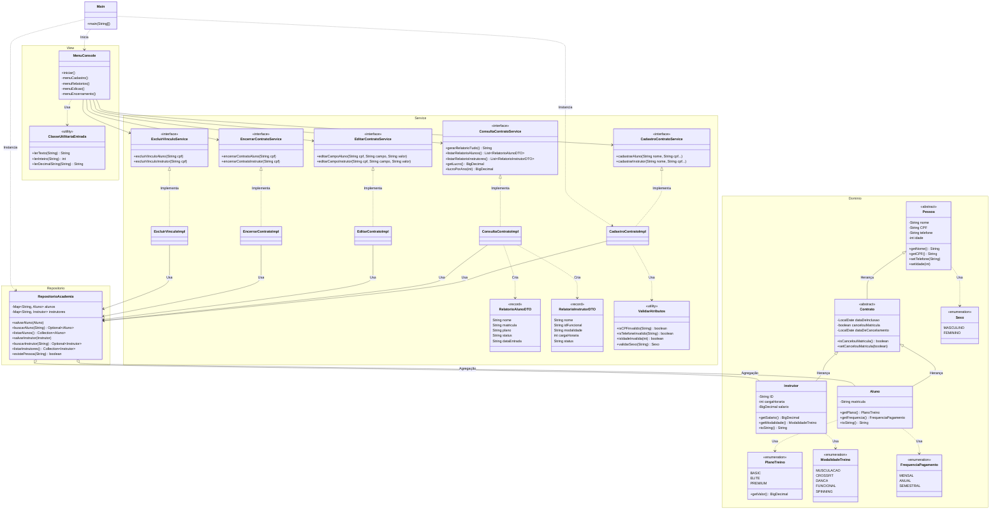

# Sistema de Gerenciamento de Academia


Um sistema completo de gerenciamento de academia executado via console, focado em aplicar as melhores práticas de **Programação Orientada a Objetos (POO)**. Desenvolvido como projeto de conclusão de disciplina, este software resolve problemas reais de administração fitness, desde o controle de acesso até a gestão financeira e acompanhamento de treinos.

---

## Funcionalidades Principais

O sistema foi desenhado para atender às necessidades operacionais de uma academia moderna:

- **Gestão de Entidades:** Cadastro, edição, exclusão e consulta de Alunos, Instrutores e Planos de Treino (ex: Musculação, Calistenia, Crossfit).
- **Controle Operacional:** - Registro de frequência diária.
    - Processamento e histórico de pagamentos de mensalidades.
- **Relatórios Gerenciais:** Geração de listagens estratégicas, como:
    - Alunos inadimplentes.
    - Relatório de desempenho e frequência de alunos.
    - Instrutores e suas respectivas especialidades.
- **Validação de Dados:** Sistema robusto que previne entradas inválidas (ex: validação de formato de CPF, e-mail e datas).

---

## 📂 Estrutura do Projeto

```text
src/
├── dominio/           
│   ├── enums/
│   ├── exceptions/
│   └── ...
│
├── repositorio/       
│   └── RepositorioAcademia.java (Banco de dados em memória)
│
├── service/
│   ├── dto/
│   ├── impl/
│   └── ...
│
├── view/
│   ├── util/
│   └── MenuConsole.java
│
└── Main.java
```

---

## 📊 Diagrama de Classes



```mermaid
classDiagram
    %% --- PACOTE DOMINIO ---
    namespace Dominio {
        class Pessoa {
            <<abstract>>
            -String nome
            -String CPF
            -String telefone
            -int idade
            +getNome() String
            +getCPF() String
            +setTelefone(String)
            +setIdade(int)
        }

        class Contrato {
            <<abstract>>
            -LocalDate dataDeInclusao
            -boolean cancelouMatricula
            -LocalDate dataDeCancelamento
            +isCancelouMatricula() boolean
            +setCancelouMatricula(boolean)
        }

        class Aluno {
            -String matricula
            +getPlano() PlanoTreino
            +getFrequencia() FrequenciaPagamento
            +toString() String
        }

        class Instrutor {
            -String ID
            -int cargaHoraria
            -BigDecimal salario
            +getSalario() BigDecimal
            +getModalidade() ModalidadeTreino
            +toString() String
        }

        class Sexo {
            <<enumeration>>
            MASCULINO
            FEMININO
        }

        class PlanoTreino {
            <<enumeration>>
            BASIC
            ELITE
            PREMIUM
            +getValor() BigDecimal
        }

        class ModalidadeTreino {
            <<enumeration>>
            MUSCULACAO
            CROSSFIT
            DANCA
            FUNCIONAL
            SPINNING
        }
        
        class FrequenciaPagamento {
            <<enumeration>>
            MENSAL
            ANUAL
            SEMESTRAL
        }
    }

    %% RELACIONAMENTOS DOMINIO
    Pessoa <|-- Contrato : Herança
    Contrato <|-- Aluno : Herança
    Contrato <|-- Instrutor : Herança
    Pessoa ..> Sexo : Usa
    Aluno ..> PlanoTreino : Usa
    Aluno ..> FrequenciaPagamento : Usa
    Instrutor ..> ModalidadeTreino : Usa

    %% --- PACOTE REPOSITORIO ---
    namespace Repositorio {
        class RepositorioAcademia {
            -Map~String, Aluno~ alunos
            -Map~String, Instrutor~ instrutores
            +salvarAluno(Aluno)
            +buscarAluno(String) Optional~Aluno~
            +listarAlunos() Collection~Aluno~
            +salvarInstrutor(Instrutor)
            +buscarInstrutor(String) Optional~Instrutor~
            +listarInstrutores() Collection~Instrutor~
            +existePessoa(String) boolean
        }
    }

    %% RELACIONAMENTOS REPOSITORIO
    RepositorioAcademia o-- Aluno : Agregação
    RepositorioAcademia o-- Instrutor : Agregação

    %% --- PACOTE SERVICE ---
    namespace Service {
        class RelatorioAlunoDTO {
            <<record>>
            String nome
            String matricula
            String plano
            String status
            String dataEntrada
        }

        class RelatorioInstrutorDTO {
            <<record>>
            String nome
            String idFuncional
            String modalidade
            int cargaHoraria
            String status
        }
        
        class ValidarAtributos {
            <<utility>>
            +isCPFinvalido(String) boolean
            +isTelefoneInvalido(String) boolean
            +isIdadeInvalida(int) boolean
            +validarSexo(String) Sexo
        }

        %% Interfaces com Métodos
        class CadastroContratoService { 
            <<interface>> 
            +cadastrarAluno(String nome, String cpf...)
            +cadastrarInstrutor(String nome, String cpf...)
        }
        
        class ConsultaContratoService { 
            <<interface>> 
            +gerarRelatorioTudo() String
            +listarRelatorioAlunos() List~RelatorioAlunoDTO~
            +listarRelatorioInstrutores() List~RelatorioInstrutorDTO~
            +getLucro() BigDecimal
            +lucroPorAno(int) BigDecimal
        }
        
        class EditarContratoService { 
            <<interface>> 
            +editarCampoAluno(String cpf, String campo, String valor)
            +editarCampoInstrutor(String cpf, String campo, String valor)
        }
        
        class EncerrarContratoService { 
            <<interface>> 
            +encerrarContratoAluno(String cpf)
            +encerrarContratoInstrutor(String cpf)
        }
        
        class ExcluirVinculoService { 
            <<interface>> 
            +excluirVinculoAluno(String cpf)
            +excluirVinculoInstrutor(String cpf)
        }

        %% Implementações
        class CadastroContratoImpl
        class ConsultaContratoImpl
        class EditarContratoImpl
        class EncerrarContratoImpl
        class ExcluirVinculoImpl
    }

    %% RELACIONAMENTOS SERVICE
    CadastroContratoService <|.. CadastroContratoImpl : Implementa
    ConsultaContratoService <|.. ConsultaContratoImpl : Implementa
    EditarContratoService <|.. EditarContratoImpl : Implementa
    EncerrarContratoService <|.. EncerrarContratoImpl : Implementa
    ExcluirVinculoService <|.. ExcluirVinculoImpl : Implementa

    %% Dependências
    CadastroContratoImpl --> RepositorioAcademia : Usa
    ConsultaContratoImpl --> RepositorioAcademia : Usa
    EditarContratoImpl --> RepositorioAcademia : Usa
    EncerrarContratoImpl --> RepositorioAcademia : Usa
    ExcluirVinculoImpl --> RepositorioAcademia : Usa
    
    ConsultaContratoImpl ..> RelatorioAlunoDTO : Cria
    ConsultaContratoImpl ..> RelatorioInstrutorDTO : Cria
    CadastroContratoImpl ..> ValidarAtributos : Usa

    %% --- PACOTE VIEW ---
    namespace View {
        class ClasseUtilitariaEntrada {
            <<utility>>
            +lerTexto(String) String
            +lerInteiro(String) int
            +lerDecimalString(String) String
        }
        
        class MenuConsole {
            +iniciar()
            -menuCadastro()
            -menuRelatorios()
            -menuEdicao()
            -menuEncerramento()
        }
    }

    %% RELACIONAMENTOS VIEW
    MenuConsole --> CadastroContratoService
    MenuConsole --> ConsultaContratoService
    MenuConsole --> EditarContratoService
    MenuConsole --> EncerrarContratoService
    MenuConsole --> ExcluirVinculoService
    MenuConsole ..> ClasseUtilitariaEntrada : Usa

    %% --- MAIN ---
    class Main {
        +main(String[])
    }
    
    Main ..> RepositorioAcademia : Instancia
    Main ..> CadastroContratoImpl : Instancia
    Main ..> MenuConsole : Inicia
```

---

## 🚀 Como Executar o Projeto

**Pré-requisitos:**
- Java Development Kit (JDK) 17 ou superior.
- Git instalado.

**Passo a passo:**

1. Clone o repositório:
   ```bash
   git clone [https://github.com/alibruno/ifrn-poo-gerenciamentoAcademia.git](https://github.com/alibruno/ifrn-poo-gerenciamentoAcademia.git)
   ```
2. Navegue até o diretório do projeto:
   ```bash
   cd ifrn-poo-gerenciamentoAcademia
   ```
3. Compile o projeto:
   ```bash
   javac -d bin src/**/*.java
   ```
4. Execute a classe principal:
   ```bash
   java -cp bin Main
   ```
